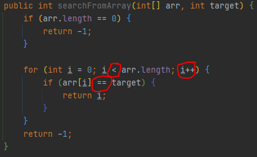

# 자료 구조

> 자료구조는 데이터를 표현하고 저장하는 방법.

## 선형 구조

> 데이터를 선의 형태로 나란히 혹은 일렬로 저장한다.

## 비선형 구조

> 데이터를 나란히 저장하지 않는다.

## 자료구조와 알고리즘의 관계

```java
public class Test {
    public int sum() {
        // 자료구조: 데이터를 표현하고 저장하는 방법.
        int[] arr = new int[]{1,2,3,4,5,6,7,8,9,10};

        int sum = 0;
        // 알고리즘: 배열에 저장된 모든 값의 합을 구하는 반복문.
        for (int i = 0; i < arr.length; i++) {
            sum += arr[i];
        }
        return sum;
    }
}
```

> **쌓여있는 상자들** 중 **머그컵을 찾아야한다.**

쌓여있는 상자는 자료구조가 되고 머그컵을 찾는 방법이 알고리즘이 된다. 자료구조에 따라 알고리즘은 달라지며, 역으로 알고리즘은 자료구조에 의존적이다.

## 시간 복잡도와 공간 복잡도

잘 동작하는 것 뿐만 아니라 좋은 성능을 보장받기를 희망한다. 알고리즘을 분석하고 평가하는 기준이 있어야 한다.

- 속도: 어떤 상황에서 빠르거나 느린지?
- 메모리: 어떤 상황에서 메모리를 적게 사용하거나 많이 사용하는지?

속도에 해당하는 알고리즘 수행시간 분석결과를 `시간 복잡도(Time Complexity)`라고 하며 메모리 사용량에 대한 알고리즘 분석 결과를 `공간 복잡도(Space Complexity)` 라고 한다.

둘 다 빠르고 적게 사용해야 최적의 알고리즘이라 할 수 있다. 그러나 일반적으로 알고리즘을 평가할 때는 메모리보다 실행 속도에 초점을 둔다. 그럼 속도는 어떻게 평가할 수 있을까?

> 연산 횟수를 세 알고리즘의 빠르기를 판단한다.



값의 동등을 비교하는 `==` 연산을 적게 수행하는 탐색 알고리즘이 좋은 탐색 알고리즘이다. `<` 비교 연산과 `++` 증감 연산은 비교연산의 수행 횟수가 줄어들면 줄어들고 늘어나면 늘어나는 의존적인 관계다.

다시 빠르기로 돌아와서 운이 좋아 대상을 앞에서 찾는다면 비교연산 횟수는 1 이되고 운이 나빠 대상을 맨 뒤에서 찾거나 없으면 비교연산 횟수는 n(배열의 길이) 이된다.

1. 최선의 경우 (best case): 1
2. 최악의 경우 (worst case): n

최선의 경우는 관심 대상이 아니다. 대부분 1번과 같이 만족할만한 결과를 가지기 때문이다. 따라서 최악의 경우가 알고리즘 성능 판단에 중요한 지표이다.

사실 최악도 최선도 아닌 평균인 경우가 가장 성능판단의 지표일 것이다. 문제는 계산하는게 어렵다는 것이다.

### 순차 탐색 시간 복잡도 최악의 경우

> 데이터 수가 n 개 일때, 최악의 경우에 해당하는 연산횟수는 n 회이다.

`T(n) = n`

### 순차 탐색 시간 복잡도 평균의 경우

1. 배열에 대상이 아예 없을 확률은 50% 라고 가정한다.
2. 배열의 첫 요소부터 마지막 요소까지, 탐색 대상이 존재할 확률은 같다고 가정한다.

> 대상이 아예 없는 경우 `n`: 데이터 수가 `n` 개이고 총 `n` 번 비교 연산을 수행한다. `n` 수행해야 없는 것을 알 수 있다.

> 탐색 대상이 존재하는 경우 `n/2`: 데이터 수가 `n` 개이고 존재할 경우는 50% 이기에 `n/2`

*대상이 배열에 존재하지 않는 경우*와 *존재하는 경우*의 확률이 각각 50% 이니 이 둘을 하나의 식으로 묶어야 한다.

`T(n) = n * 1/2 + n/2 * 1/2 = 3/4n`

`1/2` 씩 곱하여 더한 이유는 탐색 대상이 존재하지 않을 확률과 존재할 확률이 각각 50% 이기 때문이다.

그러나 우리는 이 경우를 2가지 가정을 통해서 획득하였으며, 이 두 개의 가정을 뒷받침할 근거가 부족하다.

> 따라서 평균의 경우에 대한 시간 복잡도보다는 최악의 경우에 대한 시간 복잡도를 기준으로 삼게 된다.

## 빅-오 표기법 (Big-Oh Notation)

다항식으로 표현된 경우 최고차항이 빅-오가 된다.

- T(n) = 2n + 1 ... O(n)
- T(n) = n<sup>4</sup> + 10n<sup>3</sup> + 1 ... O(n<sup>4</sup>)