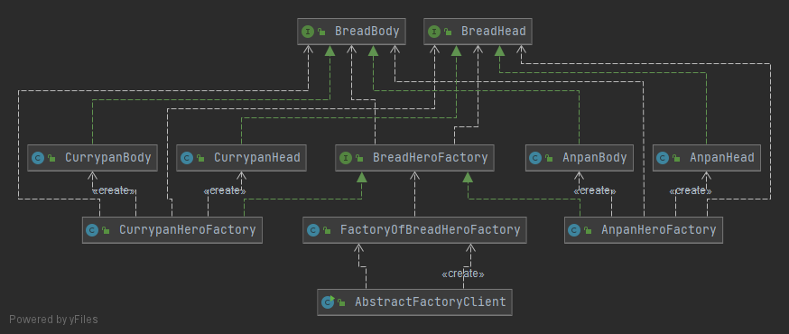

# 추상 팩토리

> 상세화된 서브클래스를 정의하지 않고도 서로 관련성이 있거나 독립적인 여러 객체의 군을 생성하기 위한 인터페이스를 제공한다.

## 의도

상세화된 서브클래스를 정의하지 않고 서로 관련성이 있거나 독립적인 여러 객체 군을 생성하기 위한 인터페이스를 제공한다.

## 활용

1. 객체가 생성되거나 구성, 표현되는 방식과 관계 없이 시스템을 독립적으로 만들고자 할 때
2. 여러 제품군 중 하나를 선택하여 시스템을 설정해야 하고 한번 구성한 제품을 다른 것으로 대체할 수 있을 때
3. 관련된 제품 객체들이 함께 사용되도록 설계되었고, 이 부분에 대한 제약이 외부에도 지켜지도록 하고 싶을 때
4. 제품에 대한 클래스 라이브러리를 제공하고, 그들의 구현이 아닌 인터페이스를 노출시키고 싶을 때

## 결과

1. 구체적인 클래스를 분리한다.
   - 팩토리는 제품 객체를 생성하는 과정과 책임을 캡슐화
2. 제품군을 쉽게 대체할 수 있도록 한다.
   - 팩토리를 변경하여 서로 다른 제품을 쉽게 사용/교체할 수 있다.
3. 제품 사이의 일관성을 증진시킨다.
   - 하나의 군에 속한 제품이 함께 동작하도록 설계되어 있을 때, 이에 대한 일관성을 유지하도록 보장할 수 있다.
4. 새로운 종류의 제품을 제공하기 어렵다.
   - 추상 팩토리에 고정되어 있기 때문에 새로운 종류의 제품 등장시 팩토리 구현을 변경해야한다. 

## 구현

1. 팩토리를 단일체로 정의한다.
2. 제품을 생성한다.
3. 확장 가능한 팩토리들을 정의한다.

