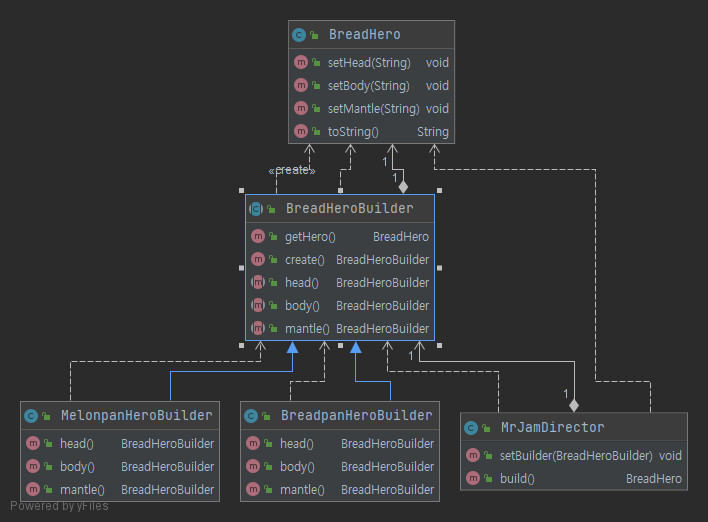

# 빌더

> 복잡한 객체를 생성하는 방법과 표현하는 방법을 정의하는 클래스를 별도로 분리하여, 서로 다른 표현이라도 이를 생성할 수 있는 동일한 절차를 제공한다. 

## 의도

복잡한 객체를 생성하는 방법과 표현하는 방법을 정의하는 클래스를 별도로 분리하여, 서로 다른 표현이라도 이를 생성할 수 있는 동일한 절차를 제공한다.

## 활용

1. 복잡 객체의 생성 알고리즘이 이를 합성하는 요소 객체들이 무엇인지 이들의 조립 방법에 독립적일 때
2. 합성할 객체들의 표현이 서로 다르더라도 생성 절차에서 이를 지원해야 할 때

## 참여자

- `Builder`: 빌더 인터페이스.
  - `Product` 객체의 일부 요소들을 생성하기 위한 추상 인터페이스를 정의한다.
- `ConcreteBuilder`: 빌더 인터페이스의 구현체.
  - `Builder` 클래스에 정의된 인터페이스를 구현하며, 제품의 부품들을 모아 빌더를 복합한다. 생성한 요소의 표현을 정의하고 관리한다. 그리고 제품을 검색하는데 필요한 인터페이스를 제공한다.
- `Director`: 빌더를 사용해 객체를 생성한다.
  - `Builder` 인터페이스를 사용하는 객체를 합성한다.
- `Product`: 디렉터가 빌더를 통해 만들어낸 생성 객체.
  - 생성할 복합 객체를 표현한다.

## 결과

1. 제품에 대한 내부 표현을 다양하게 변화할 수 있다.
2. 생성과 표현에 필요한 코드를 분리한다.
   - 복합 객체를 생성하고 복합 객체의 내부 표현 방법을 별도의 모듈로 정의할 수 있다.
3. 복합 객체를 생성하는 절차를 좀 더 세밀하게 나눌 수 있다.

## 구현

1. 조합과 구축에 필요한 인터페이스를 정의한다.
2. 제품에 대한 추상클래스는 필요 없다.
   - 제품을 표현하는 방식이 서로 다르고 공통점도 없기에 인터페이스를 가질 수도 없고 그럴 필요도 없다.
3. Builder 에 있는 메소드에 대해서는 구현을 제공하지 않는다.

## 연관 패턴

복잡한 객체를 생성할 때 추상 팩토리 패턴은 빌더와 유사한 모습을 보인다.

두 패턴의 근본적인 차이는 다음과 같다.

- 빌더는 복잡한 객체의 **단계별 생성에 중점**을 두었다. 마지막 단계에서 생성한 제품을 반환한다.
- 추상 팩토리는 제품의 유사군이 존재할 때 **유연한 설계에 중점**을 두었다. 만드는 즉시 제품을 반환한다.
