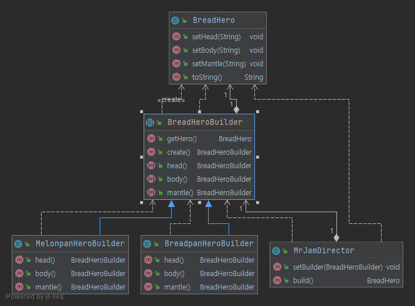

# 팩토리 메소드

> 객체를 생성하기 위해 인터페이스를 정의하지만, 어떤 클래스의 인스턴스를 생성할 지에 대한 결정은 서브클래스에게 내리도록 한다. 

## 의도

- 객체의 생성을 캡슐화 한다.
- `Creator` 의 서브 클래스에 팩토리 메소드를 정의하여, 팩토리 메소드를 호출로 적절한 `ConcreteProduct` 인스턴스를 반환한다.

## 활용

- 어떤 클래스가 자신이 생성해야 하는 객체를 예측할 수 없을 때
- 생성할 객체를 기술하는 책임을 자신의 서브클래스가 지정했으면 할 때
- 객체의 생성의 책임을 몇 개의 보조 서브클래스 가운데 하나에게 위임하고, 어떤 서브클래스가 위임자인지에 대한 정보를 국소화(localization)시키고 싶을 때

## 참여자

- `Product(Document)`: 팩토리 메소드가 생성하는 객체의 인터페이스
- `ConcreteProduct(MyDocument)`: `Product` 클래스에 정의된 인터페이스의 실제 구현체
- `Creator(Applcation)`: `Product` 객체를 반환하는 팩토리 메소드를 선언한다.
- `ConcreteCreator(MyApplication)`: 팩토리 메소드를 재정의하여 `ConcreteProduct` 의 인스턴스를 반환한다.

## 결과

1. 서브 클래스에 대한 훅(hook) 메소드를 제공한다.
   - 객체별로 서로 다른 버전을 제공하는 훅 기능을 서브클래스에 정의한다.
   - `Document` 의 서브 클래스는 이 팩토리 메소드를 재정의하여 응용 프로그램에 적합한 다른 형태의 정의할 수 있다.
2. 병렬적인 클래스 계통을 연결하는 역할을 담당한다.
   - 클래스가 자신의 책임을 분리된 다른클래스에 위임할 때 발생한다.
   - 사용자와의 상호작용을 구현하고 특정한 조작에 관련된 상태를 추적 및 저장하는 별도의 `Manipulator` 객체를 사용하는 것이 바람직하다.

## 구현

1. 구현 방법은 크게 2가지로 구현할 수 있다.
  - `Creator` 클래스를 추상 클래스로 정의. 팩토리 메소드에 대한 기본 구현은 제공하지 않는다. 추상 클래스에 대한 서브 클래스를 반드시 정의해야 한다.
  - `Creator` 클래스가 구체 클래스로 정의. 팩토리 메소드에 대한 기본 구현을 제공한다. 팩토리 메소드를 사용하여 유연성을 보장해야한다.
2. 팩토리 메소드를 매개변수화 한다.
  - 다른 방법으로는 팩토리 메소드를 이용하여 여러 종류의 제품을 생성하는 방법도 있다. 매개변수를 받아 어떤 종류의 제품을 생성하는지 식별하는 것이다.
3. 언어마다 구현 방법이 조금 다를 수 있다.
4. 템플릿을 사용하여 서브 클래싱을 피한다.
  - `Creator` 클래스의 서브 클래스가 되는 템플릿 클래스를 정의하여 해당 클래스가 `Product` 클래스로 매개변수화 되도록 만드는 것이다. 
5. 명명 규칙을 따르는 것도 중요한 일이다.

## 연관 패턴

추상 팩토리 패턴은 팩토리 메소드를 이용하여 구현할 때가 많다. 추상 팩토리의 패턴의 '동기' 절에서는 팩토리 메소드의 모습을 볼 수 있다.

팩토리 메소드는 템플릿 메소드 패턴에서도 사용될 때가 많다.

프로토타입 패턴은 `Creator` 클래스의 상속이 필요하지 않다. 그러나 `Product` 클래스에 정의된 초기화 연산은 필요하다.
